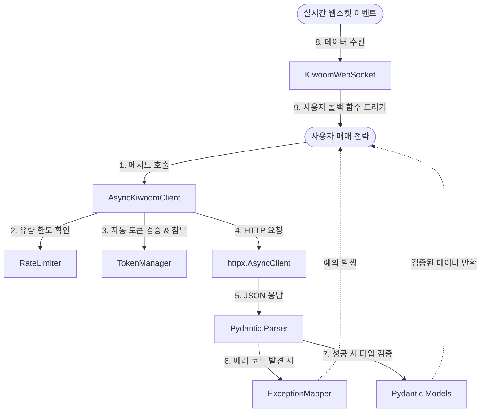

# 🏗️ kiwoom-rest-trade 아키텍처 설계서 (ARCHITECTURE.md)

본 문서는 키움증권 REST API를 래핑하는 현대적인 비동기 파이썬 라이브러리인 `kiwoom-rest-trade` 패키지의 시스템 설계와 핵심 설계 결정을 다룹니다.

---

## 1. 아키텍처 설계 원칙

1. **Async-First (비동기 우선)**: 실전 자동매매 환경에서는 속도와 효율적인 I/O 처리가 생명입니다. 모든 네트워크 통신(HTTP, WebSocket)은 `asyncio`를 기반으로 설계합니다. 단, 초보 개발자를 위해 내부 비동기 루프를 감싸는 동기(Sync) 인터페이스도 함께 제공합니다.
2. **Type Safety (타입 안전성)**: 키움 REST API의 수많은 요청/응답 필드에 완벽한 타입 힌트와 검증을 제공하기 위해 `Pydantic v2`를 적극적으로 도입합니다.
3. **Smart Rate Limiting (스마트 유량 제어)**: 키움증권 서버에서 정의한 가혹한 호출 횟수 제한(1초당 5회~10회 등)에 걸려 계정 정지나 에러가 나지 않도록 라이브러리 레벨에서 API 요청 주기를 자동으로 미세 조정합니다.
4. **Codegen-Friendly (자동화 코드 생성)**: 337개에 달하는 방대한 TR 목록을 직접 손으로 코딩하는 비효율과 실수 가능성을 제거하기 위해, 수집된 API 스펙 데이터(`kiwoom_api_spec.json`) 기반으로 모델 및 API 메서드 코드를 자동 생성(Codegen)하는 구조를 취합니다.

---

## 2. 디렉토리 구조 (Package Layout)

라이브러리는 다음과 같이 관심사를 명확하게 분리하여 구성됩니다.

```
kiwoom/
├── __init__.py          # 패키지 진입점, 통합 클라이언트 노출
├── client.py            # AsyncKiwoomClient 및 KiwoomClient(동기) 정의
├── auth.py              # 토큰 발급/갱신 및 서명 인증 모듈
├── exceptions.py        # 키움 에러 코드에 맞춘 예외 계층 정의
├── limiter.py           # 유량 제어(Rate Limit) 데코레이터 및 토큰 버킷
├── websocket.py         # 웹소켓(WebSocket) 실시간 시세 및 체결 스트리밍
├── models/              # Pydantic 데이터 모델 (Codegen 대상)
│   ├── __init__.py
│   ├── base.py          # 공통 Pydantic 베이스 클래스 정의
│   ├── auth.py          # OAuth 관련 스키마
│   ├── domestic.py      # 국내주식 관련 스키마 (자동생성)
│   └── overseas.py      # 해외주식 관련 스키마 (자동생성)
└── api/                 # REST API 엔드포인트 메서드 모듈 (Codegen 대상)
    ├── __init__.py
    ├── base.py          # API 요청 전송 공통 로직
    ├── auth.py          # 인증 API 호출부
    ├── domestic.py      # 국내주식 API 호출부 (자동생성)
    └── overseas.py      # 해외주식 API 호출부 (자동생성)
```

---

## 3. 핵심 모듈 간 관계 및 흐름 (Mermaid Diagram)

사용자(Trader)가 `AsyncKiwoomClient`를 통해 국내 주식 현재가를 조회하고 체결 통보를 받는 전체적인 흐름입니다.



---

## 4. 세부 설계 결정 (Design Decisions)

### 4.1. 비동기/동기 하이브리드 인터페이스
라이브러리의 핵심은 비동기 클라이언트(`AsyncKiwoomClient`)입니다. 내부 통신에는 `httpx.AsyncClient` 커넥션 풀을 활용해 효율을 극대화합니다.
비동기가 어색한 사용자를 위해 다음과 같은 동기식 래퍼(`KiwoomClient`)도 함께 지원합니다.

```python
# 1. 비동기식 사용 (권장)
import asyncio
from kiwoom import AsyncKiwoomClient

async def main():
    client = AsyncKiwoomClient(appkey="...", secretkey="...")
    balance = await client.domestic.get_balance(acnt_no="...")
    print(balance)

asyncio.run(main())

# 2. 동기식 사용 (동기 래퍼)
from kiwoom import KiwoomClient

client = KiwoomClient(appkey="...", secretkey="...")
balance = client.domestic.get_balance(acnt_no="...")  # 내부적으로 asyncio.run 또는 루프를 돌려 처리
print(balance)
```

### 4.2. Pydantic 기반 데이터 모델링 & 코드젠 전략
키움의 `kiwoom_api_spec.json` 파일에는 각 TR(예: `ka10001` - 주식기본정보요청)의 request body 필드명, 타입, 필수 여부 등이 고스란히 담겨 있습니다.
이를 파이싱하여 파이썬 코드를 자동 생성합니다.

```python
# [예시] 자동 생성될 models/domestic.py 의 일부
from pydantic import BaseModel, Field
from typing import Optional

class StockBasicInfoRequest(BaseModel):
    fid_cond_mrkt_div_code: str = Field(..., description="시장구분코드 (J: 주식, W: ELW 등)")
    fid_input_iscd: str = Field(..., description="종목코드")

class StockBasicInfoResponse(BaseModel):
    prdy_vrss: int = Field(..., description="전일대비")
    stck_prpr: int = Field(..., description="주식현재가")
    # ... 45개 필드 매핑
```

* **Codegen 장점**: API 스펙이 변경되더라도 빌드 시점에 스펙 JSON만 업데이트하고 스크립트를 한 번 실행해주면 라이브러리 전체 코드가 동기화됩니다.

### 4.3. 똑똑한 비동기 유량 제어 (Rate Limiting)
키움 REST API는 국내 주식 1초당 5회, 미국 주식 1초당 10회(피크타임 3회)의 엄격한 유량 한도를 갖습니다.
`limiter.py`에서는 각 카테고리별로 `Semaphore` 또는 **토큰 버킷(Token Bucket)** 구조의 비동기 속도 제한기를 둡니다.

```python
class RateLimiter:
    def __init__(self, requests_per_second: float):
        self.delay = 1.0 / requests_per_second
        self.lock = asyncio.Lock()
        self.last_called = 0.0

    async def wait(self):
        async with self.lock:
            now = asyncio.get_event_loop().time()
            elapsed = now - self.last_called
            sleep_time = self.delay - elapsed
            if sleep_time > 0:
                await asyncio.sleep(sleep_time)
            self.last_called = asyncio.get_event_loop().time()
```
API를 호출하는 모든 엔드포인트 메서드에 이 데코레이터나 Limiter의 `wait()`를 적용하여 호출 주기가 정밀하게 강제되도록 처리합니다.

### 4.4. 에러 코드 핸들링 계층
`kiwoom_error_codes.json`에 기반하여 에러 코드를 적절한 파이썬 익셉션으로 번역합니다.

- `KiwoomError` (최상위 예외)
  - `KiwoomAuthError` (8001~8200 번대 인증/단말 실패 관련 에러)
  - `KiwoomRateLimitError` (1700~1702 번대 유량 초과 관련 에러)
  - `KiwoomValidationError` (1501~1517 번대 필드/값 오류 관련 에러)
  - `KiwoomAPIError` (기타 키움 서버에서 리턴한 비즈니스 에러)

API 응답을 받으면 응답 헤더나 바디 내의 에러 정보를 검사하여 자동으로 해당 예외 인스턴스를 발생(`raise`)시킵니다.

### 4.5. WebSocket 실시간 스트리밍 관리
실시간 데이터를 송수신하기 위해 웹소켓 연결(`kiwoom/websocket.py`)을 랩핑합니다.
- `websockets` 라이브러리를 이용하여 이벤트 루프 기반으로 구동됩니다.
- 네트워크 단절 시 자동으로 토큰을 재발행하고 웹소켓 연결을 복구하는 **자동 재연결(Auto-reconnect)** 기능을 포함합니다.
- 사용자는 원하는 종목과 TR(호가, 체결)을 구독(`subscribe`)하고, 이벤트 발생 시 실행할 콜백 함수만 등록해 두면 백그라운드 태스크에서 안전하게 실행됩니다.
