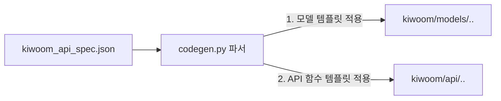

# 🤖 kiwoom-rest-trade 코드 생성기 설계서 (CODEGEN_GUIDE.md)

본 문서는 `kiwoom_api_spec.json` 데이터를 읽어 337개의 키움 REST API 요청/응답에 대응하는 파이썬 코드(Pydantic 모델 및 클라이언트 메서드)를 자동으로 생성하는 **코드 생성기(Codegen)**의 설계 및 구현 가이드입니다.

---

## 1. 코드 생성기(Codegen)의 작동 흐름

코드 생성기는 개발 단계 또는 API 스펙 변경 시 1회성으로 실행되는 독립형 스크립트입니다.



1. **스펙 파일 로드**: `data/kiwoom_api_spec.json` 파일을 파싱하여 메모리에 로드합니다.
2. **카테고리별 분류**: `category_large` 필드를 기준으로 국내주식(`domestic`), 미국주식(`overseas`), 인증(`auth`)으로 분류합니다.
3. **Pydantic 모델 생성**: 각 TR의 `request.body` 및 `response.body` 명세를 기반으로 `kiwoom/models/` 폴더에 검증 클래스를 생성합니다.
4. **API 메서드 코드 생성**: 각 TR의 HTTP Method, URL, Header, Body 구조를 조합하여 `kiwoom/api/` 폴더에 비동기 메서드를 생성합니다.

---

## 2. 세부 설계 규칙

### 2.1. 타입 매핑 규칙 (Type Mapping)
키움 API 스펙의 타입을 파이썬 및 Pydantic 형식으로 매핑합니다. 키움 스펙의 필드 설명이나 데이터 예시를 참고하여 파악합니다.

| 키움 스펙 타입 | 파이썬 타입 | 비고 |
|:---|:---|:---|
| `String` | `str` | 기본 문자열 |
| `Integer` / `Long` | `int` | 숫자 |
| `Float` / `Double` | `float` | 소수점 |
| `Array` / `List` | `list[NestedModel]` | 중첩 데이터 구조 |
| `null` 또는 미지정 | `str` | 기본값 `str`로 안전하게 폴백 |

* **선택적 필드(Optional)**: `required` 값이 `"N"`인 경우 `Optional[T] = None`으로 매핑합니다.

### 2.2. 필드 네이밍 규칙
* 키움 API의 필드명은 일반적으로 `fid_cond_mrkt_div_code` 등 스네이크 케이스(Snake Case) 또는 카멜 케이스로 되어 있습니다.
* 코드의 가독성을 위해 키움에서 제공하는 원본 필드명을 그대로 Pydantic 모델의 필드명으로 사용하되, 파이썬 예약어(예: `import`, `class`, `type` 등)와 충돌하는 경우 뒤에 언더바(`_`)를 붙여 회피합니다. (예: `type` -> `type_`)
* Pydantic의 `Field(..., description="한글 설명")`을 적극 활용하여 IDE에서 마우스 호버 시 한글 툴팁이 뜨도록 유도합니다.

---

## 3. 코드 템플릿 구조 (Templates)

가장 직관적이고 가벼운 **파이썬 f-string** 또는 **Jinja2 템플릿**을 사용하여 코드를 생성합니다.

### 3.1. Pydantic 모델 템플릿 예시
```python
# {category}.py 모델 파일의 헤더
from pydantic import BaseModel, Field
from typing import Optional, List

# 각 TR에 대해 반복 생성될 클래스 포맷
class {ClassName}Request(BaseModel):
    """
    {api_name} ({api_id}) 요청 모델
    """
    {RequestFields}

class {ClassName}Response(BaseModel):
    """
    {api_name} ({api_id}) 응답 모델
    """
    {ResponseFields}
```

### 3.2. API 메서드 템플릿 예시
```python
# api/{category}.py 에 정의될 비동기 API 클래스의 메서드 포맷
class {CategoryClassName}API:
    
    async def {method_name}(self, request: {ClassName}Request) -> {ClassName}Response:
        """
        {api_name} ({api_id})
        
        URL: {url} (Method: {http_method})
        """
        # API 호출 전송 공통 로직 실행
        response_json = await self._request(
            method="{http_method}",
            path="{url}",
            headers={headers_dict},
            json=request.model_dump(exclude_none=True)
        )
        return {ClassName}Response.model_validate(response_json)
```

---

## 4. 코드 생성기 구현 예시 (`tools/codegen.py`)

실제 프로젝트 루트 아래 `tools/codegen.py`로 생성할 파이썬 스크립트의 기본 뼈대입니다.

```python
import json
from pathlib import Path

def load_spec():
    with open("data/kiwoom_api_spec.json", encoding="utf-8") as f:
        return json.load(f)

def clean_desc(desc):
    if not desc:
        return ""
    return desc.replace("\n", " ").replace('"', '\\"')

def generate_models(spec):
    # category별로 분류해서 Pydantic 모델 코드 문자열을 생성하고 파일에 씀
    print("Generating Pydantic models...")
    # ... 상세 루프 구현

def generate_apis(spec):
    # category별로 분류해서 클라이언트 메서드 코드를 생성하고 파일에 씀
    print("Generating API endpoints...")
    # ... 상세 루프 구현

def main():
    spec = load_spec()
    generate_models(spec)
    generate_apis(spec)
    print("✨ Code Generation Completed!")

if __name__ == "__main__":
    main()
```

---

## 5. 코드 생성기 실행 및 검증 절차

코드 생성기가 완성되면 아래 명령어를 통해 코드를 즉시 찍어내고 품질 검사까지 일괄 수행합니다.

```bash
# 1. 가상환경 진입 상태에서 코드 생성 스크립트 실행
uv run python tools/codegen.py

# 2. 자동 생성된 코드의 포맷팅 및 정적 분석 수행
uv run ruff format kiwoom/
uv run ruff check kiwoom/ --fix

# 3. 타입 힌트 에러 검사
uv run mypy kiwoom/
```
