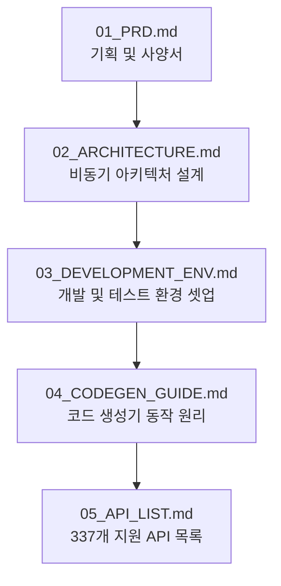

# 📖 kiwoom-rest-trade 가이드 문서 목차 (Documentation Map)

본 디렉토리는 `kiwoom-rest-trade` 라이브러리의 설계 사상, 개발 환경 설정, 자동 코드 생성 및 API 매핑 가이드를 체계적으로 보관하는 곳입니다. 

처음 프로젝트에 참여하셨거나 개발에 기여하고 싶으시다면 아래의 **가이드 학습 추천 순서**에 따라 문서를 차례대로 학습하시는 것을 권장합니다.

---

## 🧭 가이드 문서 읽는 추천 순서 (Recommended Reading Order)

---

## 🗂️ 문서별 핵심 요약 및 링크

### 1. [01_PRD.md (기획 및 요구사항 사양서)](01_PRD.md)
* **목적**: 라이브러리의 개발 배경, 최종 목표, 마일스톤별 MVP 개발 범위 정의.
* **주요 내용**: 프로젝트 개요, 기술 제약 조건 및 릴리즈 로드맵 정보.

### 2. [02_ARCHITECTURE.md (아키텍처 설계서)](02_ARCHITECTURE.md)
* **목적**: 동시성 자동매매 시스템을 위한 아키텍처 설계 원칙과 패키지 레이아웃 제시.
* **주요 내용**: Async-First 원칙, Rate Limiting 설계 방식 및 비동기 인증 갱신 흐름 다이어그램(Mermaid).

### 3. [03_DEVELOPMENT_ENV.md (개발 환경 설정 가이드)](03_DEVELOPMENT_ENV.md)
* **목적**: 협업 개발자들이 로컬 환경을 구축하고 테스트를 수행하기 위한 개발 툴 가이드.
* **주요 내용**: 파이썬 `uv` 패키지 매니저 셋업, `Ruff`/`Mypy` 품질 정적 도구 실행법 및 PyPI 패키징/배포 절차.

### 4. [04_CODEGEN_GUIDE.md (코드 생성기 설계 가이드)](04_CODEGEN_GUIDE.md)
* **목적**: 337개 키움 TR의 모델 및 메서드 코드를 자동 생성하는 `codegen.py` 엔진의 원리 설명.
* **주요 내용**: 필드명 중간 공백 정제, 숫자 접두사 필드의 alias 매핑 기법 및 대소문자 충돌 예외 처리 내역.

### 5. [05_API_LIST.md (전체 337개 지원 API 매핑 인덱스)](05_API_LIST.md)
* **목적**: 키움증권 REST API ID와 라이브러리 내 파이썬 메서드 호출 주소 간의 1대1 매핑 사전.
* **주요 내용**: 대분류/중분류 카테고리 필터링 및 복사하여 즉시 활용 가능한 메서드 호출 주소 테이블.
